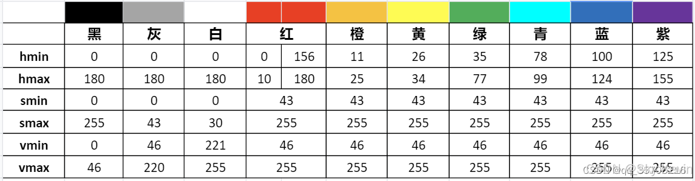
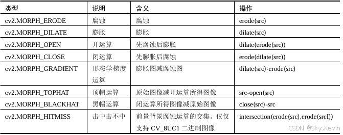
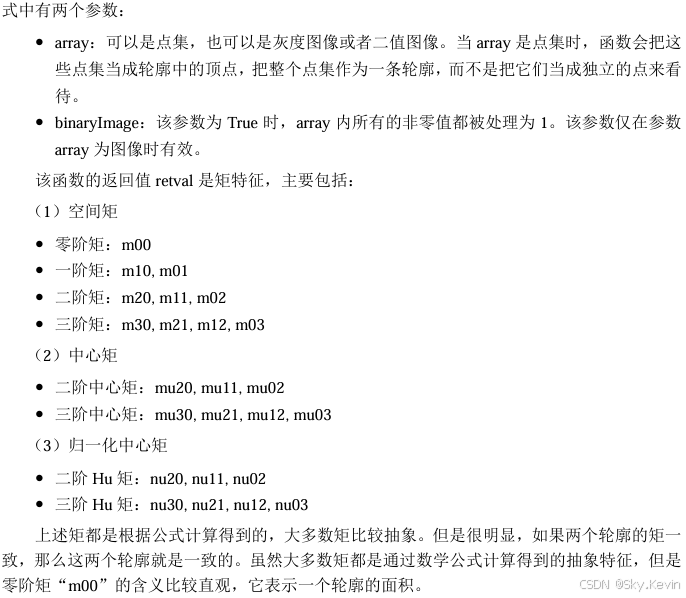
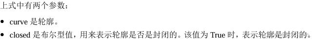
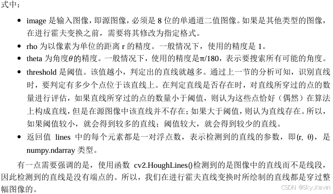
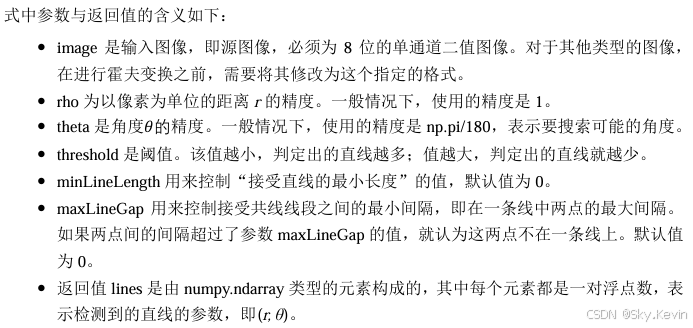
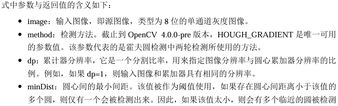
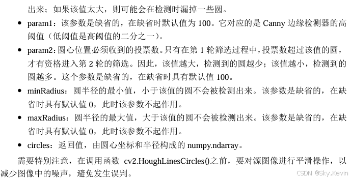

# OpenCV 常用函数汇总

## 一、色彩空间类型转换

### 1、cv2.cvtColor

`dst = cv2.cvtColor( src, code [, dstCn] )`

式中：

dst 表示输出图像，与原始输入图像具有同样的数据类型和深度。  

src 表示原始输入图像。可以是8位无符号图像、16位无符号图像，或者单精度浮点数等。  

code 是色彩空间转换码，表4-2展示了其枚举值。  

dstCn 是目标图像的通道数。如果参数为默认的 0，则通道数自动通过原始输入图像和 code 得到。  

### 2、HSV 色彩表



### 3、cv2.inRange

`dst = cv2.inRange( src, lowerb, upperb )`

式中：

 dst 表示输出结果，大小和src一致。

 src 表示要检查的数组或图像。

 lowerb 表示范围下界。

 upperb 表示范围上界。 返回值dst 与src 等大小，其值取决于src中对应位置上的值是否处于区间[lowerb,upperb] 内：

 如果src值处于该指定区间内，则dst中对应位置上的值为255。  如果src值不处于该指定区间内，则dst中对应位置上的值为0。

#### 确定颜色区域

`mask = cv2.inRange(hsv, lower, upper)`

## 二、阈值处理

### 1、cv2.threshold()

`retval, dst = cv2.threshold( src, thresh, maxval, type )`

 retval 代表返回的阈值。  

 dst 代表阈值分割结果图像，与原始图像具有相同的大小和类型。  

 src 代表要进行阈值分割的图像，可以是多通道的，8位或32位浮点型数值。  

 thresh 代表要设定的阈值。  

 maxval 代表当type参数为THRESH_BINARY或者THRESH_BINARY_INV类型时，需要设定的最大值。  

 type 代表阈值分割的类型。  

#### 二值化阈值处理（cv2.THRESH_BINARY）

所有大于127的像素点会被处理为255。 其余值会被处理为0。

`t,rst=cv2.threshold(img,127,255,cv2.THRESH_BINARY)`

```python
import cv2 
img=cv2.imread("lena.bmp") 
t,rst=cv2.threshold(img,127,255,cv2.THRESH_BINARY) 
cv2.imshow("img",img) 
cv2.imshow("rst",rst) 
cv2.waitKey() 
cv2.destroyAllWindows()
```

### 2、cv2.adaptiveThreshold() 自适应阈值处理

`dst = cv.adaptiveThreshold( src, maxValue, adaptiveMethod, thresholdType, blockSize, C )`

`athdGAUS=cv2.adaptiveThreshold(img,255,cv2.ADAPTIVE_THRESH_GAUSSIAN_C,cv2.THRESH_BINARY,5,3)`

 dst 代表自适应阈值处理结果。

 src 代表要进行处理的原始图像。需要注意的是，该图像必须是8位单通道的图像。

 maxValue 代表最大值。

 adaptiveMethod 代表自适应方法。

 thresholdType 代表阈值处理方式，该值必须是 cv2.THRESH_BINARY 或者cv2.THRESH_BINARY_INV 中的一个。

 blockSize 代表块大小。表示一个像素在计算其阈值时所使用的邻域尺寸，通常为3、5、 7 等。

 C是常量。

函数cv2.adaptiveThreshold()根据参数 adaptiveMethod 来确定自适应阈值的计算方法，函数 包含cv2.ADAPTIVE_THRESH_MEAN_C 和 cv2.ADAPTIVE_THRESH_GAUSSIAN_C 两种不 同的方法。这两种方法都是逐个像素地计算自适应阈值，自适应阈值等于每个像素由参数 blockSize 所指定邻域的加权平均值减去常量C。两种不同的方法在计算邻域的加权平均值时所 采用的方式不同：  cv2.ADAPTIVE_THRESH_MEAN_C：邻域所有像素点的权重值是一致的。  cv2.ADAPTIVE_THRESH_GAUSSIAN_C：与邻域各个像素点到中心点的距离有关，通过高斯方程得到各个点的权重值。

## 三、图像平滑处理

### 1、均值滤波 cv2.blur()

`dst = cv2.blur( src, ksize, anchor, borderType )`

`r=cv2.blur(o,(5,5))`

### 2、方框滤波 cv2.boxFilter()

`dst = cv2.boxFilter( src, ddepth, ksize, anchor, normalize, borderType )`

`r=cv2.boxFilter(o,-1,(5,5))`

### 3、高斯滤波 cv2.GaussianBlur()

`dst = cv2.GaussianBlur( src, ksize, sigmaX, sigmaY, borderType )`

```python
import cv2 
o=cv2.imread("image\\lenaNoise.png") 
r=cv2.GaussianBlur(o,(5,5),0,0) 
cv2.imshow("original",o) 
cv2.imshow("result",r) 
cv2.waitKey() 
cv2.destroyAllWindows()
```

### 4、中值滤波 cv2.medianBlur()

`dst = cv2.medianBlur( src, ksize)`
`r=cv2.medianBlur(o,3)`

### 5、双边滤波 cv2.bilateralFilter()

`dst = cv2.bilateralFilter( src, d, sigmaColor, sigmaSpace, borderType )`

```python
import cv2 
o=cv2.imread("image\\bilTest.bmp") 
b=cv2.bilateralFilter(o,55,100,100) 
cv2.imshow("original",o) 
cv2.imshow("bilateral",b) 
cv2.waitKey() 
cv2.destroyAllWindows()
```

## 四、形态学操作

`dst = cv2.morphologyEx( src, op, kernel[, anchor[, iterations[, borderType[, borderValue]]]] )`



### 开运算

```python
import cv2 
import numpy as np 
img = cv2.imread("opening.bmp") 
kernal = np.ones((3,3),np.uint8) 
mask = cv2.morphologyEx(img, cv2.MORPH_OPEN, kernel, iterations=3)
cv2.imshow("mask", mask) 
cv2.waitKey() 
cv2.destroyAllWindows()
```

### 闭运算

```python
import cv2 
import numpy as np 
img=cv2.imread("closing.bmp") 
kernal=np.ones((10,10),np.uint8) 
mask = cv2.morphologyEx(mask, cv2.MORPH_CLOSE, kernel, iterations=3)
cv2.imshow("img",img) 
cv2.imshow("mask",mask) 
cv2.waitKey() 
cv2.destroyAllWindows()
```

## 五、Canny 边缘检测 cv2.Canny()

`edges = cv.Canny( image, threshold1, threshold2[, apertureSize[, L2gradient]])`

```python
import cv2 
o=cv2.imread("lena.bmp",cv2.IMREAD_GRAYSCALE) 
r1=cv2.Canny(o,128,200) 
r2=cv2.Canny(o,32,128) 
cv2.imshow("original",o) 
cv2.imshow("result1",r1) 
cv2.imshow("result2",r2) 
cv2.waitKey() 
cv2.destroyAllWindows()
```

## 六、图像轮廓

### 1、cv2.findContours()

`image, contours, hierarchy = cv2.findContours( image, mode, method)`

`image,contours, hierarchy = cv2.findContours(binary, cv2.RETR_EXTERNAL, cv2.CHAIN_APPROX_SIMPLE)`

### 2、cv2.drawContours()

```python
image=cv2.drawContours( 
image,  
contours,  
contourIdx,  
color[,  
thickness[,  
lineType[,  
hierarchy[,  
maxLevel[,  
offset]]]]] )
```

`mask=cv2.drawContours(mask,contours,-1,(255,255,255),-1)`

### 3、矩特征

#### （1）矩的计算：moments 函数

`retval = cv2.moments( array[, binaryImage] )`



在OpenCV中，函数cv2.moments()会同时计算上述空间矩、中心矩和归一化中心距。

```python
import cv2 
import numpy as np 
o = cv2.imread('moments.bmp')   
cv2.imshow("original",o) 
gray = cv2.cvtColor(o,cv2.COLOR_BGR2GRAY)   
ret, binary = cv2.threshold(gray,127,255,cv2.THRESH_BINARY)   
image,contours, hierarchy = cv2.findContours(binary, cv2.RETR_LIST, cv2.CHAIN_APPROX_SIMPLE)   
n=len(contours) 
contoursImg=[] 
for i in range(n): 
    temp=np.zeros(image.shape,np.uint8) 
    contoursImg.append(temp) 
    contoursImg[i]=cv2.drawContours(contoursImg[i],contours,i,255,3)  
    cv2.imshow("contours[" + str(i)+"]",contoursImg[i])  
print("观察各个轮廓的矩（moments）:") 
for i in range(n): 
    print("轮廓"+str(i)+"的矩:\n",cv2.moments(contours[i])) 
print("观察各个轮廓的面积:") 
for i in range(n): 
    print("轮廓"+str(i)+"的面积:%d" %cv2.moments(contours[i])['m00']) 
cv2.waitKey() 
cv2.destroyAllWindows()
```

```python
M = cv2.moments(largest_contour)

if M['m00'] != 0:
    cx = int(M['m10'] / M['m00'])
    cy = int(M['m01'] / M['m00'])
```

#### （2）计算轮廓的面积：contourArea 函数

`retval =cv2.contourArea(contour [, oriented] )`

```python
import cv2 
import numpy as np 
o = cv2.imread('contours.bmp')   
gray = cv2.cvtColor(o,cv2.COLOR_BGR2GRAY)   
ret, binary = cv2.threshold(gray,127,255,cv2.THRESH_BINARY)   
image,contours, hierarchy = cv2.findContours(binary, cv2.RETR_LIST, cv2.CHAIN_APPROX_SIMPLE)   
cv2.imshow("original",o) 
n=len(contours) 
contoursImg=[] 
for i in range(n): 
    print("contours["+str(i)+"]面积=",cv2.contourArea(contours[i])) 
    temp=np.zeros(o.shape,np.uint8) 
    contoursImg.append(temp) 
    contoursImg[i]=cv2.drawContours(contoursImg[i], contours, i, (255,255,255), 3) 
    cv2.imshow("contours[" + str(i)+"]",contoursImg[i])    
cv2.waitKey() 
cv2.destroyAllWindows()
```

#### （3）计算轮廓的长度：arcLength 函数

`retval = cv2.arcLength( curve, closed )`



## 七、角点检测

### Shi-Tomasi 角点检测

```python
cv2.goodFeaturesToTrack(img, 
                        corners,
                        maxCorners,
                        qualityLevel,
                        minDistance,
                        mask,
                        blockSize,
                        gradientSize,
                        useHarrisDetector=False, 
                        k=0.04
                       )
```

```python
import cv2
import numpy as np
 
# Shi-Tomasi角点检测部分
# 图像预处理
img = cv2.imread('Example4.png', flags=cv2.IMREAD_GRAYSCALE)
img_bgr = cv2.imread('Example.jpg')
img = cv2.resize(img, None, fx=0.5, fy=0.5)
img_bgr = cv2.resize(img_bgr, None, fx=0.5, fy=0.5)
kernel = np.ones((3,3), dtype=np.uint8)
img_open = cv2.morphologyEx(img, cv2.MORPH_OPEN, kernel, iterations=3)
img_close = cv2.morphologyEx(img_open, cv2.MORPH_CLOSE, kernel, iterations=10)
img_erode = cv2.morphologyEx(img_close, cv2.MORPH_ERODE, kernel, iterations=4)
img_blur = cv2.medianBlur(img_erode, 39)
cv2.imshow('blur', img_blur)
#  shi-tomasi角点检测
corners = cv2.goodFeaturesToTrack(img_blur, 4, 0.01, 300)
print(corners)
#  显示角点
for i in corners:
    x,y = i.ravel()
    cv2.circle(img_bgr,(int(x),int(y)),5,(0,0,255),-1)
cv2.imshow('dst', img_bgr)
cv2.waitKey(0)
cv2.destroyAllWindows()
```

## 八、霍夫变换

### 1、霍夫直线变换 cv2.HoughLines()

`lines=cv2.HoughLines(image, rho, theta, threshold)`



#### 概率霍夫变换 cv2.HoughLinesP()

`lines =cv2.HoughLinesP(image, rho, theta, threshold, minLineLength, maxLineGap)`



```python
import cv2 
import numpy as np 
import matplotlib.pyplot as plt 
img = cv2.imread('computer.jpg',-1) 
gray = cv2.cvtColor(img,cv2.COLOR_BGR2GRAY) 
edges = cv2.Canny(gray,50,150,apertureSize =3) 
orgb=cv2.cvtColor(img,cv2.COLOR_BGR2RGB) 
oShow=orgb.copy() 
lines = cv2.HoughLinesP(edges,1,np.pi/180,1,minLineLength=100,maxLineGap=10) 
for line in lines: 
x1,y1,x2,y2 = line[0] 
cv2.line(orgb,(x1,y1),(x2,y2),(255,0,0),5) 
plt.subplot(121) 
plt.imshow(oShow) 
plt.axis('off') 
plt.subplot(122) 
plt.imshow(orgb) 
plt.axis('off') 
```

### 2、霍夫圆环变换 cv2.HoughCircles()

```python
circles=cv2.HoughCircles(image,  
method,  
dp,  
minDist,  
param1,  
param2,  
minRadius,  
maxRadius) 
```





```python
import cv2 
import numpy as np 
import matplotlib.pyplot as plt 
img = cv2.imread('chess.jpg',0) 
imgo=cv2.imread('chess.jpg',-1) 
o=cv2.cvtColor(imgo,cv2.COLOR_BGR2RGB) 
oshow=o.copy() 
img = cv2.medianBlur(img,5) 
circles = cv2.HoughCircles(img,cv2.HOUGH_GRADIENT,1,300, 
param1=50,param2=30,minRadius=100,maxRadius=200) 
circles = np.uint16(np.around(circles)) 
for i in circles[0,:]: 
    cv2.circle(o,(i[0],i[1]),i[2],(255,0,0),12) 
    cv2.circle(o,(i[0],i[1]),2,(255,0,0),12) 
plt.subplot(121) 
plt.imshow(oshow) 
plt.axis('off') 
plt.subplot(122) 
plt.imshow(o) 
plt.axis('off') 
```

## 九、视频处理

### VideoCapture 类

```python
cap = cv2.VideoCapture(0) 
import numpy as np 
import cv2 
cap = cv2.VideoCapture(0) 
while(cap.isOpened()): 
    ret, frame = cap.read() 
    cv2.imshow('frame',frame) 
    c = cv2.waitKey(1) 
    if c==27:   #ESC 键 
        break 
cap.release()
cv2.destroyAllWindows() 
```

#### 播放视频文件

```python
import numpy as np 
import cv2 
cap = cv2.VideoCapture('viptrain.avi') 
while(cap.isOpened()): 
    ret, frame = cap.read() 
    cv2.imshow('frame',frame) 
    c = cv2.waitKey(25) 
    if c==27:   #ESC 键 
        break 
cap.release() 
cv2.destroyAllWindows()
```

## 以上内容摘自：OpenCV轻松入门：面向 Python by 李立宗
