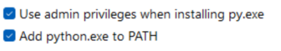
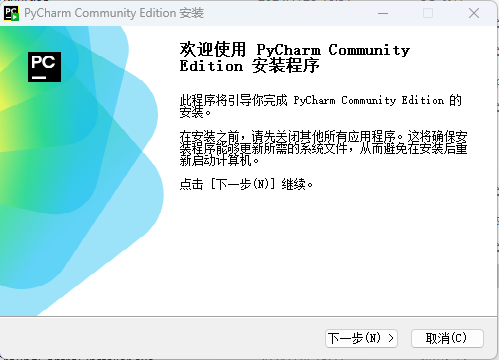
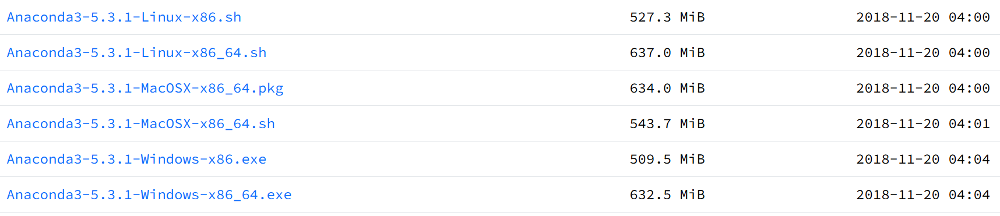
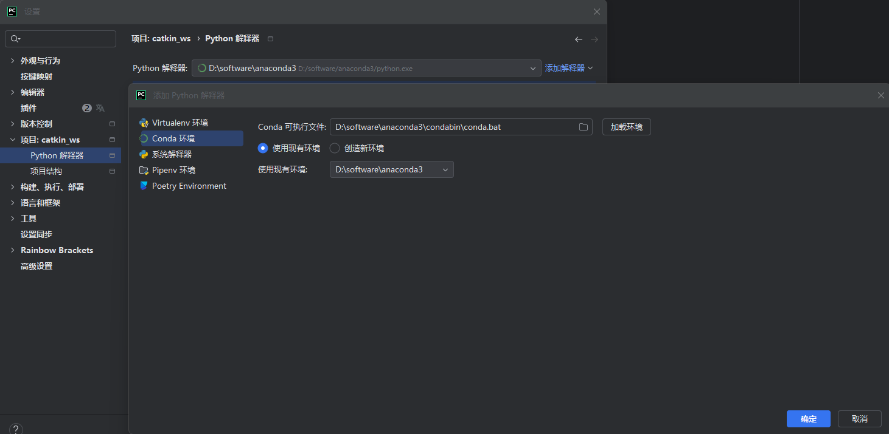
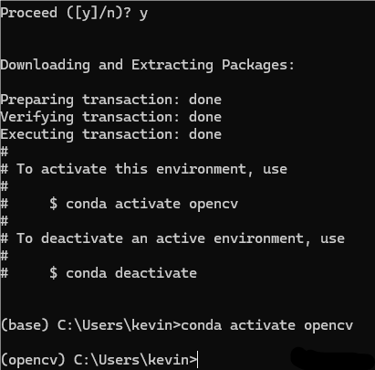
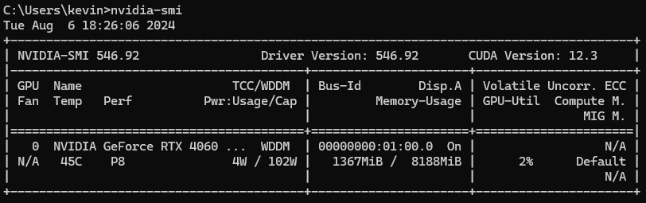
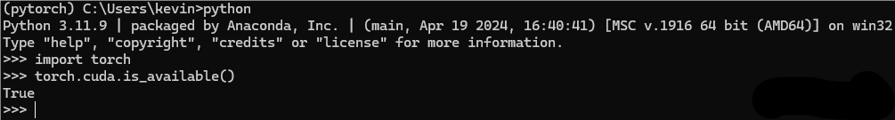

# 环境配置

## 一、安装 Python

[Python 安装地址](https://www.python.org/downloads/)



???+ "提示"
    注意 Add PATH

完成。

## 二、PyCharm

[PyCharm windows 版本下载地址](https://www.jetbrains.com/pycharm/download/#section=windows)

选择社区版下载安装（日常学习使用够用了）（PyCharm Community Edition）

也可以选择专业版，使用学校邮箱进行认证。




可自选路径


重启

中文包：


## 三、Anaconda 环境

### 1、conda 的安装

[conda 安装（清华大学开源镜像站）](https://mirrors.tuna.tsinghua.edu.cn/anaconda/archive/)



根据自己电脑选择合适版本


???+ "提示"
    注意 Add PATH

如果没有勾选，后续需要自行添加环境变量。

等待安装完成即可。


打开pycharm，使用conda环境新建项目


在设置中查看解释器：


添加解释器可添加自己创建的虚拟环境：



### 2、创建 conda 虚拟环境的方法

打开 Anaconda Prompt


```cmd
conda create -n xxx python=3.8
# xxx改成你的虚拟环境名字 python=版本号
conda activate xxx
# 激活创建的虚拟环境
```



前面的 base 变成你创建的虚拟环境名称即为成功。

[具体conda使用的常用指令可以参考大神的博客](http://t.csdnimg.cn/KNZfl)

## 四、OpenCV

先安装 numpy

`pip install numpy`

pip 安装

`pip install opencv-python`
`pip install opencv-contrib-python`

验证一下有没有安装成功

```cmd
C:\Users\kevin>python
Python 3.11.7 | packaged by Anaconda, Inc. | (main, Dec 15 2023, 18:05:47) [MSC v.1916 64 bit (AMD64)] on win32
Type "help", "copyright", "credits" or "license" for more information.
>>> import cv2
>>> print(cv2.__version__)
4.9.0
```

## 五、Pytorch（深度学习环境）

前提：你的电脑有GPU

### 1、cmd 终端输入 nvidia-smi，查看你的显卡适配的 CUDA 版本



### 2、conda 创建虚拟环境

Anaconda Prompt 输入

`conda create -n pytorch python=3.8`

`conda activate pytorch`

### 3、下载地址： [PyTorch](https://pytorch.org/)


根据你电脑支持的 CUDA 版本安装，我的电脑是 CUDA12.1

`(pytorch) C:\Users\kevin>conda install pytorch torchvision torchaudio pytorch-cuda=12.1 -c pytorch -c nvidia`

验证一下：

```cmd
python
import torch
torch.cuda.is_available()
```



如果返回值是 True，代表成功啦。恭喜你，安装完成，可以开始快乐的炼丹啦。

## 六、yolov8

[ultralytics/ultralytics: NEW - YOLOv8 🚀 in PyTorch > ONNX > OpenVINO > CoreML > TFLite (github.com)](https://github.com/ultralytics/ultralytics)

根据官方的 README 安装使用

Install

>Pip install the ultralytics package including all requirements in a Python>=3.8 environment with PyTorch>=1.8.

在有 pytorch 的 conda 虚拟环境中输入

`pip install ultralytics`

跑一个官方例程测试

`yolo predict model=yolov8n.pt source='https://ultralytics.com/images/bus.jpg'`


恭喜你，完成了 yolov8 的安装。
