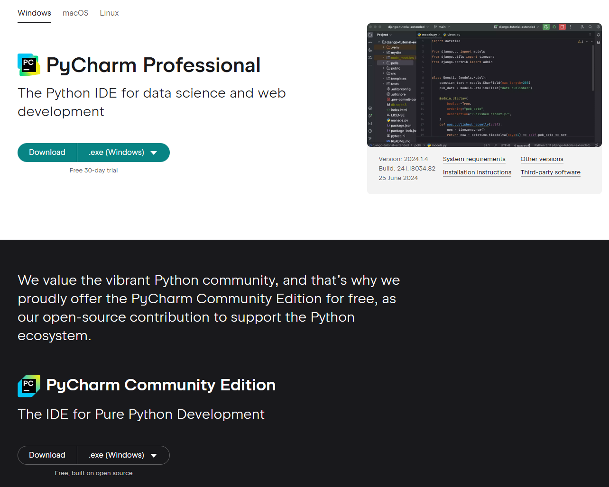
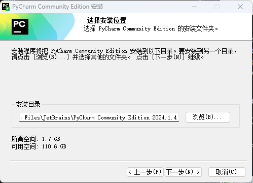
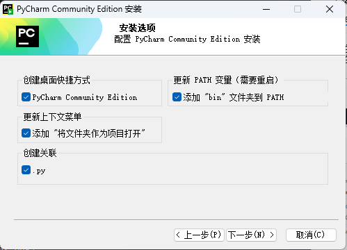
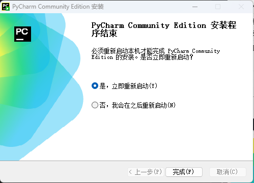
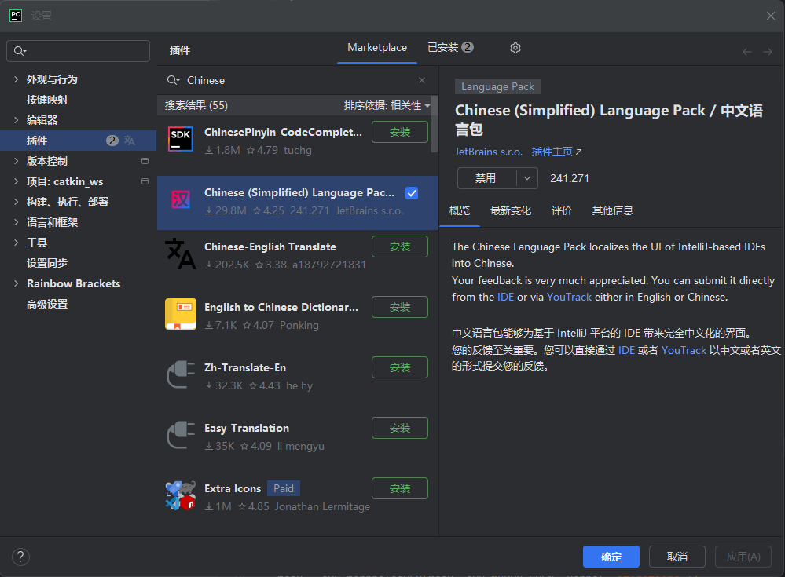
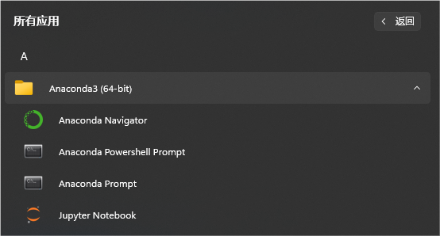
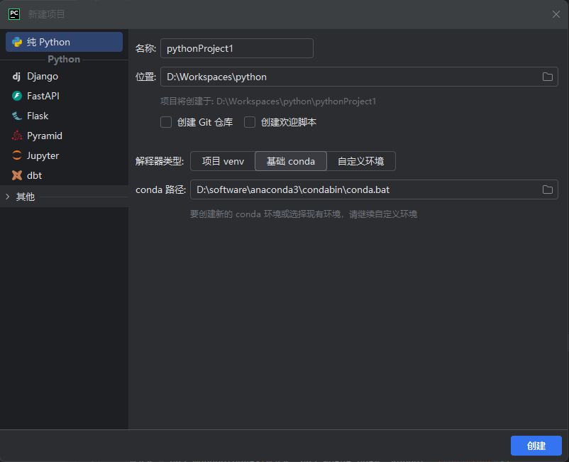
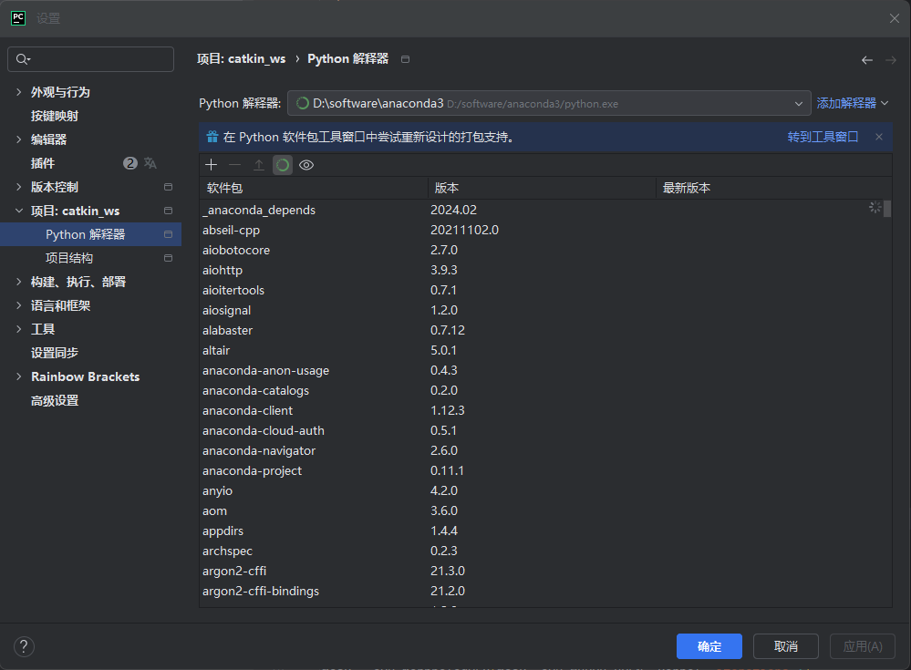
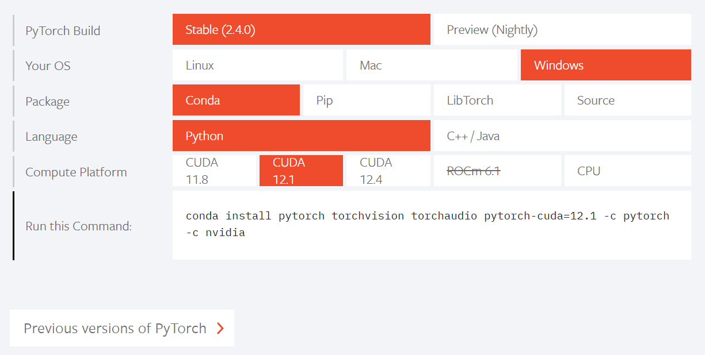
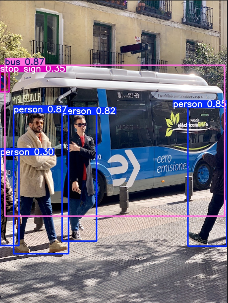

# 环境配置

## 一、安装 Python

[Python 安装地址](https://www.python.org/downloads/)


???+ "提示"
    注意 Add PATH

完成。

## 二、PyCharm

[PyCharm windows 版本下载地址](https://www.jetbrains.com/pycharm/download/#section=windows)

选择社区版下载安装（日常学习使用够用了）（PyCharm Community Edition）

也可以选择专业版，使用学校邮箱进行认证。




可自选路径







重启

中文包：



## 三、Anaconda 环境

### 1、conda 的安装

[conda 安装（清华大学开源镜像站）](https://mirrors.tuna.tsinghua.edu.cn/anaconda/archive/)


根据自己电脑选择合适版本


???+ "提示"
    注意 Add PATH

如果没有勾选，后续需要自行添加环境变量。

等待安装完成即可。



打开pycharm，使用conda环境新建项目



在设置中查看解释器：



添加解释器可添加自己创建的虚拟环境：


### 2、创建 conda 虚拟环境的方法

打开 Anaconda Prompt


```cmd
conda create -n xxx python=3.8
# xxx改成你的虚拟环境名字 python=版本号
conda activate xxx
# 激活创建的虚拟环境
```

```cmd
Downloading and Extracting Packages:

Preparing transaction: done
Verifying transaction: done
Executing transaction: done
#
# To activate this environment, use
#
#     $ conda activate opencv
#
# To deactivate an active environment, use
#
#     $ conda deactivate


(base) C:\Users\kevin>conda activate opencv

(opencv) C:\Users\kevin>
```

前面的 base 变成你创建的虚拟环境名称即为成功。

### 3、conda 常用

#### （1）换源

Windows 用户无法直接创建名为 .condarc 的文件，可先执行 `conda config --set show_channel_urls yes` 生成该文件之后再修改。

> 引用自 [https://mirrors.tuna.tsinghua.edu.cn/help/anaconda/](https://mirrors.tuna.tsinghua.edu.cn/help/anaconda/)

修改 .condarc 文件

Windows 中，该文件的位置在：C:\Users\(你的用户名)\.condarc

Linux 中，该文件的位置在：~/.condarc

将其中的内容更改为以下内容（换成清华源）

``` cmd
channels:
  - defaults
show_channel_urls: true
default_channels:
  - https://mirrors.tuna.tsinghua.edu.cn/anaconda/pkgs/main
  - https://mirrors.tuna.tsinghua.edu.cn/anaconda/pkgs/r
  - https://mirrors.tuna.tsinghua.edu.cn/anaconda/pkgs/msys2
custom_channels:
  conda-forge: https://mirrors.tuna.tsinghua.edu.cn/anaconda/cloud
  pytorch: https://mirrors.tuna.tsinghua.edu.cn/anaconda/cloud
```

换好镜像源后，使用以下命令清楚索引缓存

`conda clean -i`

#### （2）创建虚拟环境

使用conda创建虚拟环境的命令格式为:

`conda create -n env_name python=3.8`

这表示创建python版本为3.8、名字为env_name的虚拟环境。

创建后，env_name文件可以在Anaconda安装目录envs文件下找到。在不指定python版本时，自动创建基于最新python版本的虚拟环境。

#### （3）查看有哪些虚拟环境

 以下三条命令都可以

```cmd
conda env list
conda info -e
conda info --envs
```

效果如下

```cmd
(base) C:\Users\kevin>conda env list
# conda environments:
#
base                  *  D:\software\anaconda3
cv                       D:\software\anaconda3\envs\cv
deformable_detr          D:\software\anaconda3\envs\deformable_detr
labelimg                 D:\software\anaconda3\envs\labelimg
pytorch                  D:\software\anaconda3\envs\pytorch
yolov8                   D:\software\anaconda3\envs\yolov8
```

#### （4）激活虚拟环境

`conda activate env_name`

#### （5）退出虚拟环境

`conda deactivate`

#### （6）删除虚拟环境

执行以下命令可以将该指定虚拟环境及其中所安装的包都删除。

`conda remove --name env_name --all`

如果只删除虚拟环境中的某个或者某些包则是：

`conda remove --name env_name  package_name`

## 四、OpenCV

在刚刚创建的 conda 虚拟环境中

先安装 numpy

`conda install numpy`

pip 安装

`conda install opencv`

验证一下有没有安装成功

```cmd
(cv) C:\Users\kevin>python
Python 3.12.7 | packaged by Anaconda, Inc. | (main, Oct  4 2024, 13:17:27) [MSC v.1929 64 bit (AMD64)] on win32
Type "help", "copyright", "credits" or "license" for more information.
>>> import cv2
>>> print(cv2.__version__)
4.10.0
```

## 五、Pytorch（深度学习环境）

前提：你的电脑有 N 卡

### 1、cmd 终端输入 nvidia-smi，查看你的显卡适配的 CUDA 版本

```cmd
C:\Users\kevin>nvidia-smi
Tue Aug  6 18:26:06 2024
+---------------------------------------------------------------------------------------+
| NVIDIA-SMI 546.92                 Driver Version: 546.92       CUDA Version: 12.3     |
|-----------------------------------------+----------------------+----------------------+
| GPU  Name                     TCC/WDDM  | Bus-Id        Disp.A | Volatile Uncorr. ECC |
| Fan  Temp   Perf          Pwr:Usage/Cap |         Memory-Usage | GPU-Util  Compute M. |
|                                         |                      |               MIG M. |
|=========================================+======================+======================|
|   0  NVIDIA GeForce RTX 4060 ...  WDDM  | 00000000:01:00.0 Off |                  N/A |
| N/A   45C    P8              4W /  102W |   1367MiB /  8188MiB |      2%      Default |
|                                         |                      |                  N/A |
+-----------------------------------------+----------------------+----------------------+

+---------------------------------------------------------------------------------------+
| Processes:                                                                            |
|  GPU   GI   CI        PID   Type   Process name                            GPU Memory |
|        ID   ID                                                             Usage      |
|=======================================================================================|
|  No running processes found                                                           |
+---------------------------------------------------------------------------------------+
```

### 2、conda 创建虚拟环境

Anaconda Prompt 输入

`conda create -n pytorch python=3.8`

`conda activate pytorch`

### 3、下载地址： [PyTorch](https://pytorch.org/)



根据你电脑支持的 CUDA 版本安装，我的电脑是 CUDA12.1

```cmd
(pytorch) C:\Users\kevin>conda install pytorch torchvision torchaudio pytorch-cuda=12.1 -c pytorch -c nvidia
```

验证一下：

```cmd
python
import torch
torch.cuda.is_available()
```

```cmd
(pytorch) C:\Users\kevin>python
Python 3.11.9 | packaged by Anaconda, Inc. | (main, Apr 19 2024, 16:40:41) [MSC v.1916 64 bit (AMD64)] on win32
Type "help", "copyright", "credits" or "license" for more information.
>>> import torch
>>> torch.cuda.is_available()
True
>>>
```

如果返回值是 True，代表成功啦。恭喜你，安装完成，可以开始快乐的炼丹啦。

## 六、yolov8

[ultralytics/ultralytics: NEW - YOLOv8 🚀 in PyTorch > ONNX > OpenVINO > CoreML > TFLite (github.com)](https://github.com/ultralytics/ultralytics)

根据官方的 README 安装使用

Install

>Pip install the ultralytics package including all requirements in a Python>=3.8 environment with PyTorch>=1.8.

在有 pytorch 的 conda 虚拟环境中输入

`pip install ultralytics`

跑一个官方例程测试

`yolo predict model=yolov8n.pt source='https://ultralytics.com/images/bus.jpg'`



恭喜你，完成了 yolov8 的安装。
